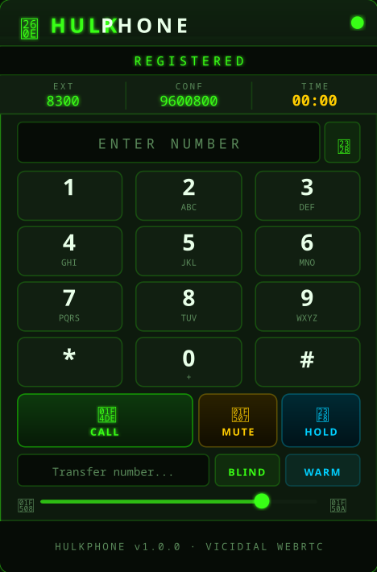

# ☎ HulkPhone — ViciDial WebRTC Softphone

> **Version 1.0.0** | Neon Green Theme | SIP.js 0.20.x | ViciDial Compatible

<p align="center">
  
</p>

---

## 🟢 What Is HulkPhone?

HulkPhone is a browser-based **WebRTC SIP softphone** built for embedding directly into the
**ViciDial** call center agent interface. It registers via WebSocket (WSS), auto-joins the
agent conference bridge, and provides a full dialpad, mute, hold, and blind/warm transfer —
all inside the ViciDial right panel iframe.

Tested and running on:
- **Rocky Linux 10**
- **Asterisk 18.21.0-vici**
- **ViciDial 2.14b0.5**
- **SIP.js 0.20.x**

---

## 📁 File Structure

```
hulkphone/
├── hulkphone.php              ← Main entry point (PHP, renders phone UI)
├── hulk_int_example.php       ← ViciDial integration bridge example
├── css/
│   └── hulkphone.css          ← Neon green Hulk theme
├── js/
│   ├── hulkphone.v2.js        ← SIP.js WebRTC core engine
│   └── sip.js                 ← SIP.js 0.20.x library
├── images/
│   └── hulkphone-preview.png  ← README preview image
└── sounds/
    └── ring.mp3               ← Ringtone
```

---

## ⚡ Installation

### 1. Clone into your ViciDial web root

```bash
cd /var/www/html
git clone https://github.com/FrancoSmash73/Hulk-.git hulkphone

chmod -R 755 /var/www/html/hulkphone
chown -R apache:apache /var/www/html/hulkphone
```

---

### 2. Asterisk PJSIP — Transport Setup

In `/etc/asterisk/pjsip.conf`, ensure you have both a UDP transport (for carrier trunks)
and a WSS transport (for WebRTC agents). The `external_media_address` and
`external_signaling_address` are **required** if your server is behind NAT:

```ini
[transport-udp]
type                        = transport
protocol                    = udp
bind                        = 0.0.0.0:5061
external_media_address      = YOUR.PUBLIC.IP
external_signaling_address  = YOUR.PUBLIC.IP
local_net                   = 192.168.0.0/255.255.0.0
local_net                   = 10.0.0.0/255.0.0.0
local_net                   = 172.16.0.0/12
tos                         = cs3

[transport-wss]
type     = transport
protocol = wss
bind     = 0.0.0.0
```

---

### 3. Asterisk PJSIP — WebRTC Endpoint Template

In `/etc/asterisk/pjsip.conf`, define a template that all WebRTC agent extensions will inherit.
Every option below is **required** — missing any one of them will cause registration or audio failure:

```ini
[webrtc_template](!)
type=endpoint
transport=transport-wss
context=default
disallow=all
allow=opus
allow=ulaw
allow=alaw
webrtc=yes                      ; ← REQUIRED — enables WebRTC mode
dtls_auto_generate_cert=yes     ; ← REQUIRED — auto DTLS cert
dtls_verify=no
dtls_rekey=0
ice_support=yes
media_use_received_transport=yes
rtcp_mux=yes
use_avpf=yes
media_encryption=dtls
direct_media=no
rtp_symmetric=yes
force_rport=yes
rewrite_contact=yes
```

---

### 4. Asterisk PJSIP — Agent Extensions

Create `/etc/asterisk/pjsip-webrtc-agents.conf` (included from `pjsip.conf`).
Each agent extension uses the `webrtc_template`:

```ini
[8300](webrtc_template)
type=endpoint
auth=auth8300
aors=8300
callerid="Agent Name" <8300>

[auth8300]
type=auth
auth_type=userpass
username=8300
password=YOUR_EXTENSION_PASSWORD

[8300]
type=aor
max_contacts=1
remove_existing=yes
```

Add one block per agent (8301, 8302, etc.).

> **Important:** The password here must match the `pass` field in ViciDial's `phones` table
> for that extension. If ViciDial's PJSIP wizard is enabled, it generates its own endpoint
> definitions from `conf_secret` — which conflict with these. See the Troubleshooting section.

Include the file in `pjsip.conf`:

```ini
#include "pjsip-webrtc-agents.conf"
```

---

### 5. Asterisk HTTP — WebSocket Server

In `/etc/asterisk/http.conf`:

```ini
[general]
enabled=yes
bindaddr=0.0.0.0
bindport=8088
tlsenable=yes
tlsbindaddr=0.0.0.0:8089
tlscertfile=/etc/asterisk/keys/YOUR_CERT.pem
tlsprivatekey=/etc/asterisk/keys/YOUR_CERT.pem
```

> Use a **valid TLS certificate** (e.g. Let's Encrypt). Self-signed certs will be rejected
> by Chrome/Firefox for WSS connections. If your cert is separate key + chain, combine them:
> `cat fullchain.pem privkey.pem > /etc/asterisk/keys/asterisk.pem`

---

### 6. Firewall Ports

```bash
# WebSocket for SIP.js
firewall-cmd --permanent --add-port=8089/tcp

# SIP (PJSIP default)
firewall-cmd --permanent --add-port=5060/udp
firewall-cmd --permanent --add-port=5061/udp

# RTP Media
firewall-cmd --permanent --add-port=10000-20000/udp

firewall-cmd --reload
```

| Port        | Protocol | Purpose                        |
|-------------|----------|--------------------------------|
| 8089        | TCP/WSS  | Asterisk WebSocket (SIP.js)    |
| 5060-5061   | UDP      | SIP signaling                  |
| 10000-20000 | UDP      | RTP media                      |

---

### 7. ViciDial — Phone Table

In ViciDial Admin, configure each WebRTC phone:

- **Phone Extension:** `8300` (matches PJSIP endpoint name)
- **Phone Type:** `SIP`
- **Protocol:** `PJSIP`
- **Pass / Secret:** must match the `password` in `pjsip-webrtc-agents.conf`
- **WebPhone:** `Y`
- **WebPhone Dialpad:** `Y`
- **WebPhone Auto Answer:** `Y`

If you sync `conf_secret` in the DB, run:

```sql
UPDATE phones SET conf_secret = pass WHERE extension BETWEEN '8300' AND '8310';
```

---

### 8. ViciDial — Set the WebPhone URL

In **ViciDial Admin → Admin → System Settings** (or per-phone):

```
https://YOUR_SERVER/hulkphone/hulkphone.php
```

ViciDial automatically appends all required parameters (extension, password, server IP,
conference extension, etc.) as base64-encoded query strings.

The phone renders inside ViciDial's **460×500px right-panel iframe**.

---

## 🔗 URL Parameters (Manual / Direct Use)

| Parameter     | Default                    | Description                          |
|---------------|----------------------------|--------------------------------------|
| `server_ip`   | *(required)*               | Asterisk server hostname or IP       |
| `ext`         | *(required)*               | SIP extension number                 |
| `pass`        | *(required)*               | SIP password                         |
| `user`        | ext                        | Agent username (display only)        |
| `conf_exten`  | —                          | Conference ext to auto-dial on register |
| `ws_port`     | `8089`                     | Asterisk WebSocket port              |
| `ws_path`     | `/ws`                      | WebSocket path                       |
| `callerid`    | ext                        | Caller ID display name               |
| `auto_answer` | `1`                        | Auto-call conference on registration |
| `language`    | `en`                       | `en` or `es`                         |
| `stun_server` | `stun.l.google.com:19302`  | STUN server for ICE                  |

---

## 🎮 Keyboard Shortcuts

| Key            | Action              |
|----------------|---------------------|
| `0–9`, `*`, `#` | Dial pad digits    |
| `Enter`        | Call / Hang up      |
| `Escape`       | Hang up             |
| `Backspace`    | Delete last digit   |
| `M`            | Toggle mute         |
| `H`            | Toggle hold         |

---

## 🐛 Troubleshooting

### Phone does not register — `Failed to authenticate`

**Cause:** ViciDial's PJSIP wizard auto-generates endpoint definitions from `phones.conf_secret`
into `pjsip_wizard-vicidial.conf`. If that file is included, it creates a **duplicate endpoint**
that overrides `pjsip-webrtc-agents.conf`, causing auth to fail (wrong password).

**Fix:** Disable the wizard include in `/etc/asterisk/pjsip_wizard.conf`:

```ini
;#include "pjsip_wizard-vicidial.conf"
; Disabled: 8300-8310 managed by pjsip-webrtc-agents.conf with WebRTC settings
```

Then reload: `asterisk -rx "module reload res_pjsip.so"`

---

### Phone registers but `webrtc: no` in endpoint show

**Cause:** `webrtc=yes` missing from the endpoint template.

**Fix:** Ensure `webrtc=yes` and `dtls_auto_generate_cert=yes` are in `[webrtc_template](!)`.

---

### One-way audio on outbound calls through a carrier trunk

**Cause:** Without explicitly setting `transport` and `media_address` on the carrier endpoint,
Asterisk advertises the private/bind IP in the SDP instead of the public IP — even if
`external_media_address` is set on the transport. The carrier sends RTP to an unreachable address.

**Fix:** In your carrier endpoint definition (put this in `pjsip.conf` directly — not in
`pjsip-vicidial.conf` which ViciDial auto-regenerates):

```ini
[your-carrier]
type=endpoint
transport=transport-udp
media_address=YOUR.PUBLIC.IP    ; ← force public IP in SDP
rtp_symmetric=no                ; carriers don't need symmetric RTP
direct_media=no
...
```

---

### WebPhone is cut off (top/bottom) inside ViciDial iframe

**Cause:** ViciDial embeds the phone in a `460×500px` iframe with `scrolling="no"`.
If the phone's total rendered height exceeds 500px, overflow is clipped.
Using `transform: scale()` reduces visual size but **not layout size** — the element
still occupies its original height, causing clipping.

**Fix:** Use actual padding reductions in `hulkphone.css` rather than CSS transforms/zoom.
Reduce padding on header, dialpad keys, and control buttons until total height ≤ 490px.
Also set `align-items: flex-start` on `body` to prevent top clipping from vertical centering.

---

## 🛠️ Customization

### Theme Colors

Edit the `:root` block in `css/hulkphone.css`:

```css
:root {
    --hulk-green:  #39ff14;  /* Main neon green  */
    --hulk-amber:  #ffcc00;  /* Mute accent      */
    --hulk-blue:   #00cfff;  /* Hold accent      */
    --hulk-red:    #ff2d2d;  /* Hangup / danger  */
    --bg-void:     #060c06;  /* Page background  */
}
```

### Add a Language

In `hulkphone.php`, add to the `$lang` array and pass `?language=fr` in the URL:

```php
'fr' => [
    'btn_call'   => 'APPELER',
    'btn_hangup' => 'RACCROCHER',
],
```

---

## 📋 Changelog

### v1.0.0
- Initial release with full SIP.js 0.20.x WebRTC support
- Tested on Rocky Linux 10 / Asterisk 18 / ViciDial 2.14
- Auto-join conference extension on registration
- DTMF dialpad with letter labels
- Mute, Hold, Blind Transfer, Warm Transfer
- English and Spanish UI
- Keyboard shortcuts
- ViciDial parent window event bridge (postMessage)
- Neon Green "Hulk" theme with scanline CRT overlay
- Call timer and volume control
- Layout sized to fit ViciDial's 460×500px right-panel iframe

---

## 🙏 Credits

- Inspired by **ViciPhone** by Michael Cargile and **CyburPhone** by carpenox / ccabrerar
- WebRTC via **SIP.js** (sipjs.com)
- ViciDial integration reference: deepwiki.com/ccabrerar/vicidial

## 📄 License

AGPL-3.0 — See LICENSE file.
